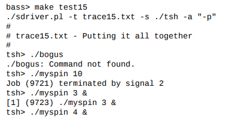
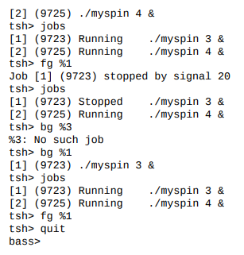

### 指导

本次实验的目的是为熟悉进程控制和信号发送的概念. 你将写一个简单的Unix Shell去支持工作控制.

复制shlab-handout.tar到你的工作目录.

* tar xvf shlab-handout.tar
* 使用make取编译和链接一些测试用例

观看tsh.c(tiny shell)文件, 你将看到其中包含一个简单shell的功能性框架.

* eval: 解析和解释命令行.
* builtin_cmd: 组织和解释内置命令: quit, fg, bg和jobs.
* do_bgfg: 执行bg和fg内置命令.
* waitfg: 等待前台进程完成.
* sigchld_handler: 捕捉SIGCHILD信号.
* sigint_handler: 捕捉SIGINT(ctrl-c)信号.
* sigtstp_handler: 捕捉SIGTSTP(ctrl-z)信号.

每次修改tsh.c之后可以make去重新编译它. 运行你的shell.

```shell
unix> ./tsh
tsh> [type commands to your shell here]
```

### Unix Shells总览

一个shell是运行用户程序的交互式命令行解释器. 一个shell重复输出提示, 等待从**stdin**输入的命令, 然后按照命令行内容的指示执行一些操作. 

一个命令行是一串通过空格分界的ASCII文本单词. 第一个单词既可以是内置命令名, 也可以是可执行文件名. 剩下的单词是命令行的参数. 如果第一个单词是内置命令行, shell立刻在当前进程执行命令. 否则, 这个单词被认为是可执行程序的文件名. 在这种情况下, shell forks一个子进程, 然后加载和运行程序. 由于解释单个命令行而创建的子进程统称为作业. 通常, 一个作业可以包含多个通过Unix管道连接的子进程. 

如果命令行以"&"结尾, job就运行在后台, 这意味着shell不会等待job停止, 而直接输出提示并且等待下一条命令行. 否则, job运行在前台, 这意味着shell等待job停止后才输出提示符. 总之, 在任意时刻, 最多只有一个job可以运行在前台. 然而, 任意数量的jobs运行在后台.

例如, 输入命令行引起shell执行内置的jobs命令.

```shell
tsh> jobs
```

输入命令行

```shell
tsh> /bin/ls -l -d
```

运行ls程序在前台. 

为了方便, shell确认在程序开始时执行其主例程.

```c
int main(int argc, char* argv[]);
```

argc和argv参数有如下值:

* argc == 3,
* argv[0] == ''/bin/ls'',
* argv[1] == ''-l'',
* argv[2] == ''-d''

输入下面的命令:

```c
tsh> /bin/ls -l -d &
```

在后台运行ls程序

Unix shells支持job控制的概念, 这允许用户将jobs置为前台或者后台, 并且改变进程的状态(running, stopped, 或者terminated). 键入ctrl+c触发SIGINT信号, 将其传递给前台job中的每个进程.SIGINT的默认动作是terminate进程. 相似地, 键入ctrl-z触发SIGTSTP, 将进程置为stopped状态, 其被挂起直到接收一个SIGCONT信号. Unix shells也提供多种内置的命令以支持job控制. 例如:

* jobs: 列出running和stopped后台jobs.
* bg \<job\>: 将stopped后台job置为running后台job.
* fg \<job\>: 将stopped或running后台job置为running前台
* kill \<job\>: Terminate a job.

### tsh明细

你的tsh shell应该具有以下特征:

* 提示应该是字符串"tsh> ".
* 用户在命令行输入应该包含一个name和0或多个参数, 其中所有参数被一个或多个空格分割. 如果name是一个内置命令, tsh应该立即处理并且等待下一个命令. 否则, tsh应该认为name是一个可执行文件的路径, 其被一个初始化子进程载入并运行.
* tsh不需要支持管道(|)或者I/O重定向(<和>).
* 键入ctrl-c(ctrl-z)应该触发一个SIGINT(SIGTSTP)信号, 其将被前台job接收, 包括当前job的后代(从当前job fork产生的子进程). 如果无前台进程, 信号无影响.
* 每个job可以被进程ID(pid)或者job ID(JID)识别, 其是一个被tsh分配的正整数. JIDs应该被表示为前缀'%'. 例如, “%5”表示JID 5, 并且"5"表示PID 5.
* tsh应该支持下列内置命令:
  - quit命令terminates the shell.
  - jobs命令罗列出所有的后台jobs.
  - bg \<job\>命令重启\<job\>, 通过发送一个SIGCONT信号, 运行其在后台. \<job\>参数既可以是PID, 也可以是JID.
  - fg \<job\>命令重启\<job\>, 通过发送一个SIGCONT信号, 运行其在前台. \<job\>参数既可以是PID, 也可以是JID.
* tsh应该支持回收所有的僵尸孩子. 如果任何job由于收到未捕获的信号而终止, tsh应该意识到这个事件并且输出一个条带有该job的PID和有问题信号的说明.

### 检查你的工作

**参考答案**. tshref是一个参考答案. 运行这个程序去查看你不理解的行为. 你的shell应该和参考答案的输出一致.

**shell driver**. sdriver.p1程序执行一个shell作为子进程, 通过trace file发送命令和信号, 从shell中捕获和显示结果.

使用-h参数取检查sdriver.p1的使用:

```shell
unix> ./sdriver.p1 -h
usage: sdriver.p1 [-hv] -t <trace> -s <shellprog> -a <args>
Options:
 -h             打印这个信息
 -v             更详细
 -t <trace>     Trace file
 -s <shell>     待测试shell程序
 -a <args>      shell参数
 -g             自动评分生成的结果
```

我们提供16个trace files文件, 以供你使用去测试你的shell的正确性. 数字越低, 测试情况越简单, 数字越高, 测试情况越复杂.

示例:

```shell
unix> ./sdriver.p1 -t trace01.txt -s ./tsh -a "-p"
```

(the -a "-p" 参数告诉你的shell不发送一个提示), 或者

```c
unix> make test01
```

相似地, 与参考shell对比你的结果, 你可以运行在参考shell

```shell
unix> ./sdriver.p1 -t trace01.txt -s ./tshref -a "-p"
```

或者

```shell
unix> make rtest01
```

对于你的参考文件, tshref.out给出了所有竞赛的参考输出. 这个对你来说更加方便.

追踪文件的输出和你运行交互式shell的输出一致.





### 提示

* waitpid, kill, fork, execve, setpgid和sigprocmask函数将非常方便. WUNTRACED和WNOHANG选项对于waitpid将是有用的.

* 当你执行你的信号处理, 确保发送SIGINT和SIGTSTP信号到整个前台进程组, 在kill函数的参数中使用"-pid"代替"pid"

* 实验的棘手部分之一是确定waitfg和sigchld处理函数之间的工作分配. 建议:

  In waitfg, use a busy loop around the sleep function.

  In sigchld_handler, use exactly one call to waitpid.

* 在eval中, 父级必须在派生子级之前使用sigprocmask来阻止SIGCHLD信号, 然后通过调用addjob将子级添加到作业列表之后, 再次使用sigprocmask来取消这些信号. 因为子级继承了父级的blocked列表, 子级必须确认执行新程序之前取消SIGCHLD信号的阻塞.

  父级需要以这种方式阻塞SIGCHLD信号, 以避免在父级调用addjob之前, 孩子被SIGCHLD处理程序回收(从而从作业列表中删除)的竞争状态.

* more, less, vi和emacs之类的程序在终端设置上会做一些奇怪的事情. 不要从你的shell运行这些程序. 坚持使用基于简单文本的程序, 例如/bin/ls, /bin/ps和/bin/echo

* 但你在标准Unix shell运行你的shell, 你的shell运行在前台进程组. 如果你的shell创建了一个子进程, 默认你的进程是前台进程组的一员. 由于输入ctrl-c会将SIGINT发送到前台组中的每个进程, 因此输入ctrl-c会将SIGINT发送到您的shell以及您的shell创建的每个进程, 这显然是不正确的.

  解决方法是: 在派生之后, 但在执行之前, 子进程应调用setpgid(0, 0), 这会将子进程放入一个新的进程组中, 该组的组ID与该子进程的PID相同. 这样可以确保在前台进程组中只有一个进程, 即Shell. 键入ctrl-c时, 外壳程序应捕获所得的SIGINT, 然后将其转发到适当的前台作业(或更准确地说, 是包含前台作业的进程组).